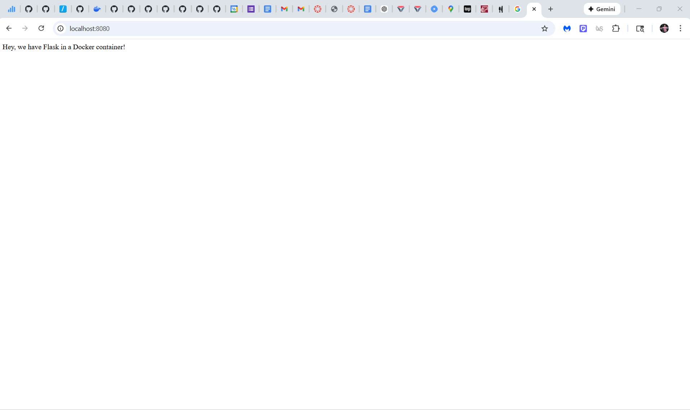

# Dockerizing Flask Web Server

In this project, I containerized a simple Flask web application using Docker and exposed it via SSH port forwarding on a remote server. I did this by adjusting outdated instructions from the now-defunct startup Runnable to work with my setup. This project helped me practice networking, using Docker, and using Flask.

